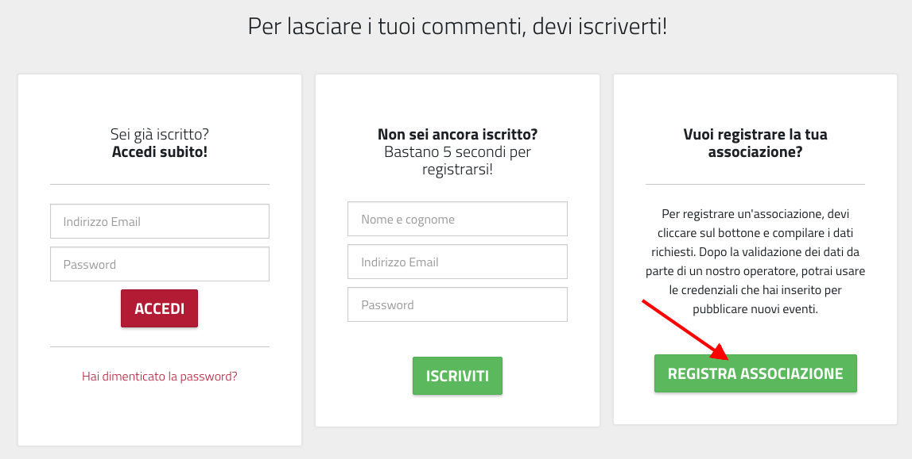
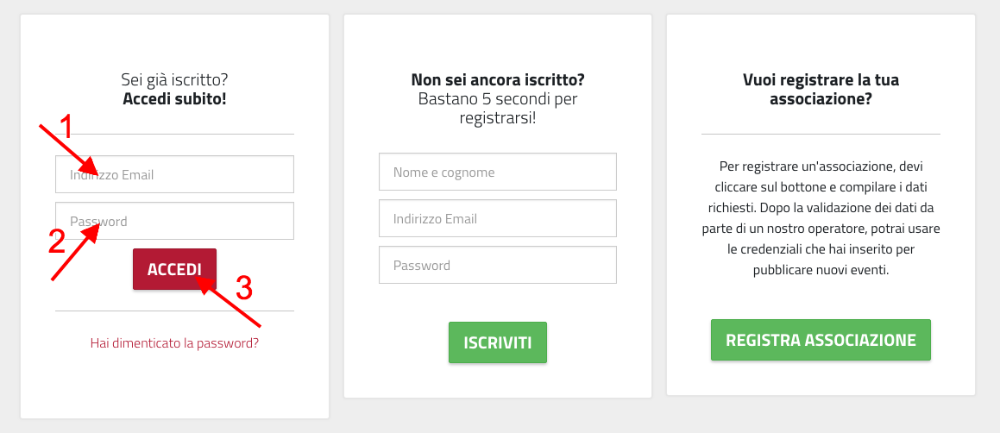

Manuale per le Associazioni e Istituti Culturali
================================================

Un soggetto (Associazione, Istituto Culturale, ...) può contribuire alla creazione 
di eventi sul sistema OpenAgenda, in modo che essi siano visibili sul calendario.

Iscrizione al sistema
----------------------
La registrazione al sistema dipende da come il sistema è configurato. 
Ci sono casi in cui l'iscrizione delle associazioni viene fatta d'ufficio da parte dell'ente, che poi 
ha cura di comunicare le credenziali alle associazioni. In alternativa le associazioni hanno la possibilità
di iscriversi al sistema attraverso il link raggiungibile dalla home page del calendario, in basso:

   il link per l'iscrizione delle Associazioni, in basso (indicato dalla freccia rossa).

Il link porta al form di registrazione di una nuova associazione. I campi indicati con l'asterisco sono obbligatori.
In questa modalià, una associazione che si registra sceglie il proprio *username* e la propria *password*.

.. important::

   Mentre la password può essere cambiata in ogni momento, non è possibile modificare il proprio username   

Accesso al sistema
------------------
Per accedere al sistema è necessario selezionare la voce "accedi" dalla barra menù del sito.

   La voce di menù "accedi" consente di effettuare l'accesso al sistema

Il sistema presenta un form di login. Per accedere è necessario inserire i propri username e password, 
per poi premere su "

   Il form di accesso al sistema

Il link “Hai dimenticato la password?” è possibile chiedere al sistema di creare una nuova password che verrà inviata
all'indirizzo email specificato.

Gestione della propria "Scheda Associazione"
--------------------------------------------

Inserimento di un evento

Inserimento di una iniziativa

Aggiungere immagini ad un evento

Raccomandazione: policy sui contenuti
